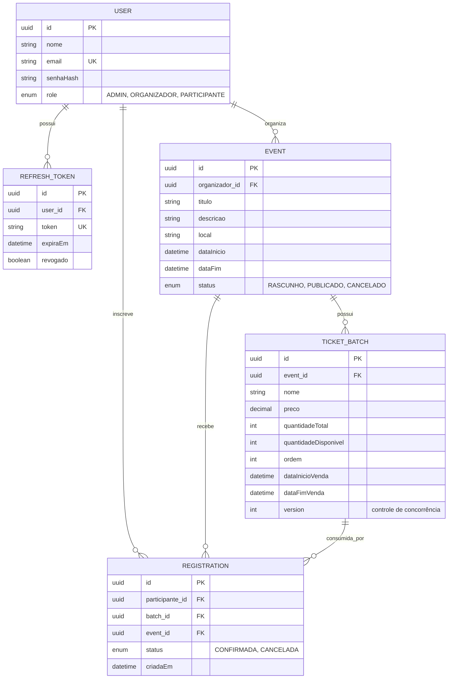

# Diagrama ER — EventFlow

## Notas de modelagem

- `REGISTRATION` referencia `event_id` além de `batch_id` para evitar join extra ao listar inscrições por evento (desnormalização proposital).
- `TICKET_BATCH.version` é o campo `@Version` do JPA usado no lock otimista.
- `REFRESH_TOKEN.token` é único e indexado para busca rápida na validação/rotação.
- `EVENT.organizador_id` só aceita usuários com `role = ORGANIZADOR` (validado em nível de aplicação, não de banco).
- Cardinalidade 1:N entre `TICKET_BATCH` e `REGISTRATION`: um lote pode ter várias inscrições, mas cada inscrição pertence a exatamente um lote.
