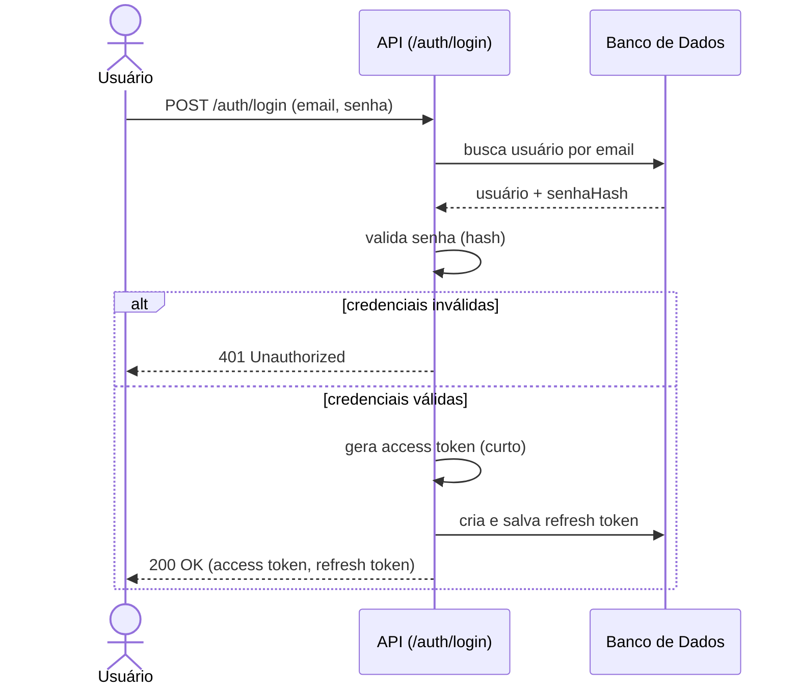
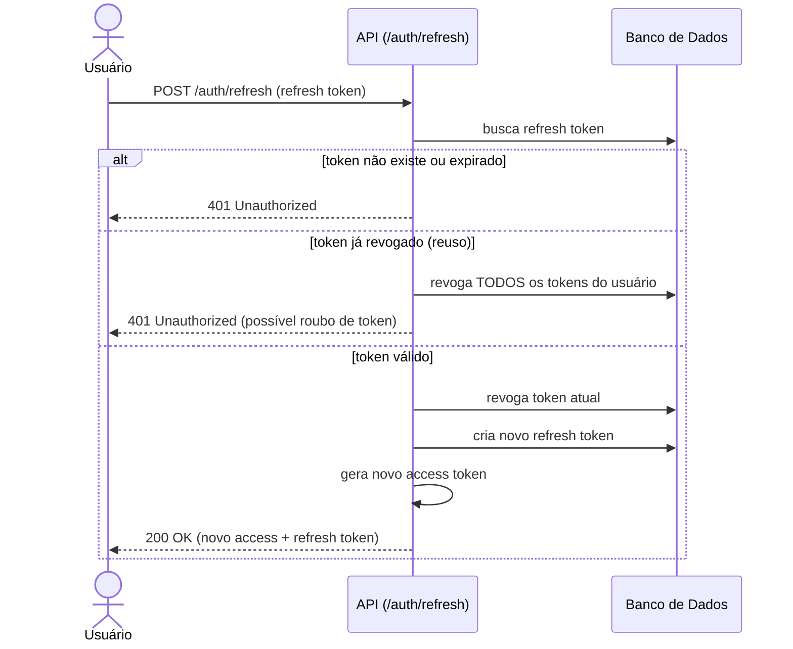
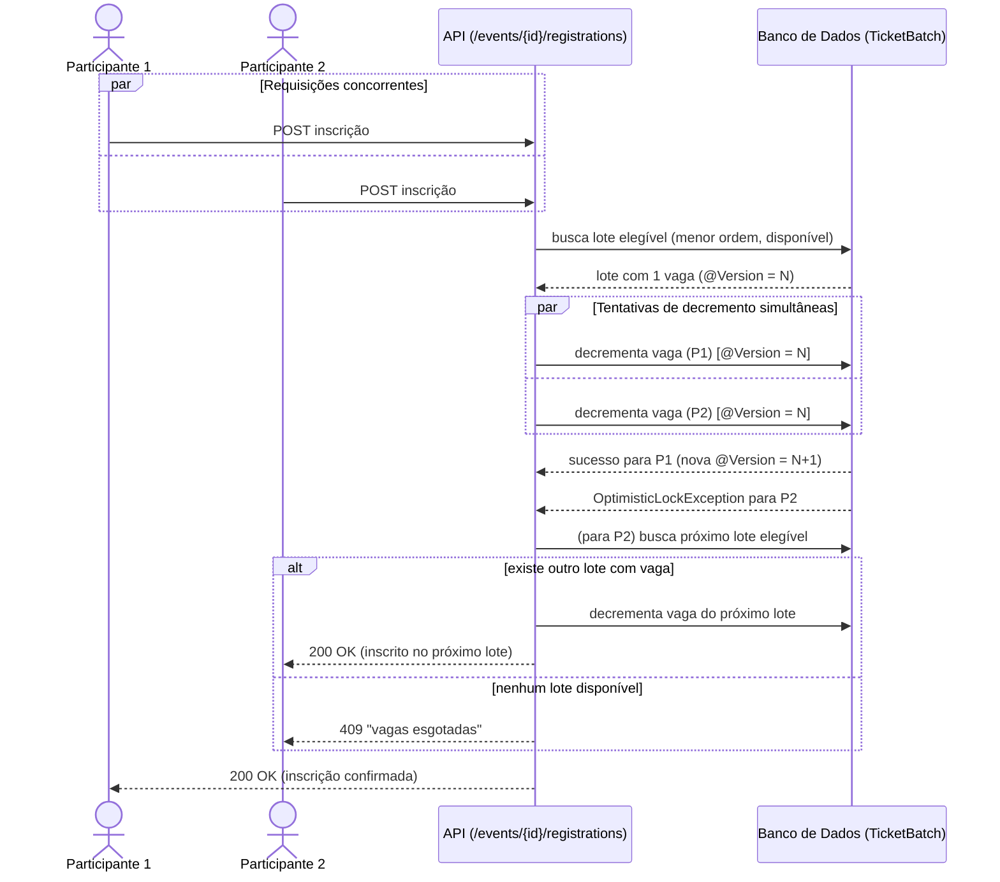
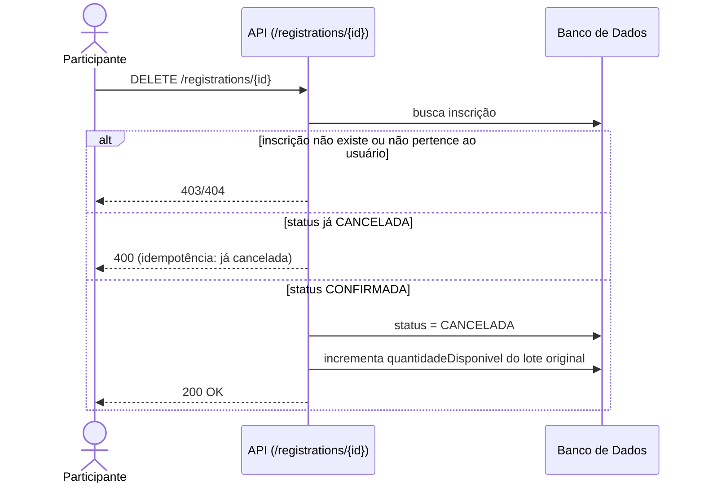
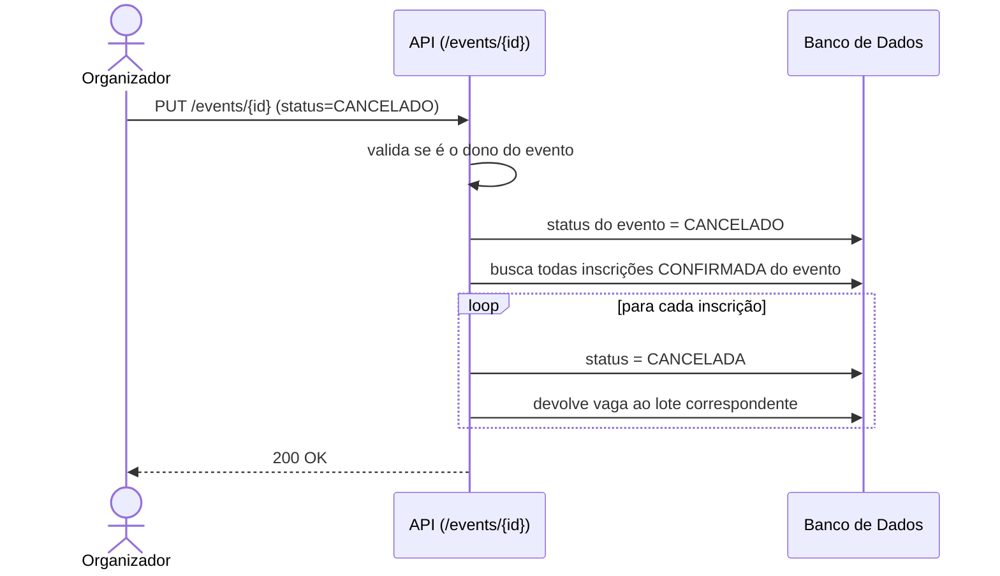

# Fluxos de Sequência — EventFlow

## 1. Login e emissão de tokens

## 2. Renovação de token (refresh rotation)

## 3. Inscrição em evento — disputa pela última vaga

## 4. Cancelamento de inscrição

## 5. Cancelamento de evento (cascata)

